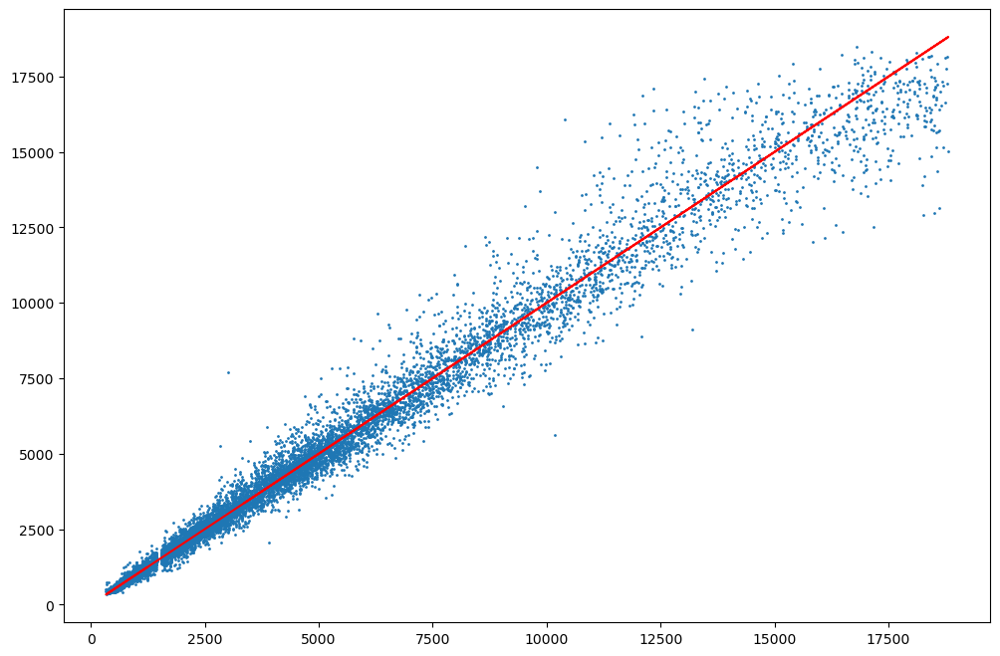

# Diamond Price Predictions using Machine Learning Models

This project focuses on predicting diamond prices using different machine-learning models. Three models - Standard Linear Regression, Random Forest Regressor, and K-Nearest Neighbors (KNN) Regressor - are evaluated to determine their performance in predicting diamond prices. The dataset used contains information about diamond attributes such as dimensions, clarity, and cut quality.

## Table of Contents

- [Introduction](#introduction)
- [Prerequisites](#prerequisites)
- [Dataset](#dataset)
- [Exploratory Data Analysis](#exploratory-data-analysis)
- [Feature Engineering](#feature-engineering)
- [Data Preparation](#data-preparation)
- [Model Evaluation](#model-evaluation)
- [Results and Conclusion](#results-and-conclusion)
- [Contributing](#contributing)
  

## Introduction

Diamonds are valued based on various attributes, and predicting their prices accurately can be beneficial for both buyers and sellers. This project demonstrates how to use machine learning models to predict diamond prices using different algorithms.

## Prerequisites

- Python (version 3.11.4)
- Jupyter Notebook (for running Python scripts)
- Libraries: `numpy`, `pandas`, `scikit-learn`, `seaborn`, `matplotlib`
- PowerBI Desktop (version 2.119.986.0) (for viewing the report and interacting with the model)

## Dataset

The dataset used for this project contains information about 54,000 diamonds and their attributes, including dimensions, clarity, and cut quality. The dataset is loaded from the 'diamonds2.csv' file.

## Exploratory Data Analysis

The initial analysis includes:
- Checking the head of the data
- Getting data information and summary statistics
- Heatmap to visualize correlations between features

## Feature Engineering

Based on high correlations between certain diamond dimensions, some dimensions are eliminated to avoid multicollinearity. A new feature, "symmetry", is created by calculating the ratio of 'x' to 'y' dimensions.

## Data Preparation

The data is preprocessed, and features are transformed using one-hot encoding. The data is then standardized using `StandardScaler`. The dataset is split into training and testing sets.

## Model Evaluation

Three machine learning models are evaluated for diamond price prediction:
- K-Nearest Neighbors (KNN) Regressor
- Random Forest Regressor
- Linear Regression
- Lasso Regression

The models are trained and tested, and their performance is evaluated using Root Mean Square Error (RMSE).

## Data Visualisations and PowerBI Report View
## Data Visualization

Explore the visualizations that provide insights into the diamond dataset.

### Correlation Heatmap

A heatmap is generated to visualize the correlations between different diamond attributes.

### Feature Importance

The feature importance analysis using the Extra Trees Regressor helps identify the most influential attributes for diamond price prediction.

### Scatter Plot

A scatter plot demonstrates the predicted prices against the actual prices for different diamonds.

### Power BI Dashboard

A Power BI dashboard report enhances data exploration and interactivity. The dashboard includes visualizations for various attributes and their impact on diamond prices.

**Power BI Dashboard Description:**

The Power BI dashboard showcases a comprehensive report on diamond attributes and their correlation with prices. It includes interactive charts, scatter plots, and filters that allow users to explore different subsets of data. The report provides insights into how attributes like carat, cut, color, and clarity influence diamond prices.

## Results and Conclusion

The RMSE values for each model are compared to evaluate their prediction accuracy. Feature importance is also assessed using the Extra Trees Regressor. The best-performing model is determined based on the lowest RMSE.

## Contributing

Contributions to this project are welcome. You can open issues, suggest improvements, or submit pull requests.

